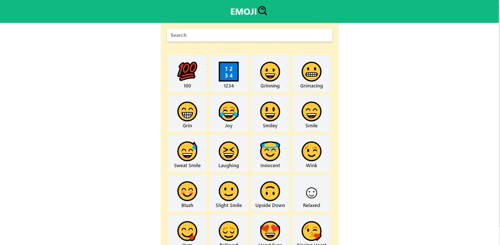

# Emoji Searcher App - React

##### Feature

- melakukan remote data fetching di React dengan axios
- menyesuaikan component yang di-render sesuai dengan proses fetching
- React state management (dengan useState)
- React life cycle (dengan useEffect)
- mengupdate state di React
- Event handling di React (onClick dan onChange)
- Memberikan type untuk props dengan prop-types
- CSS Module dan dynamic className dengan classnames
- animasi dengan React dan CSS untuk UX

&copy; Ayprojex | version 1.1.0
